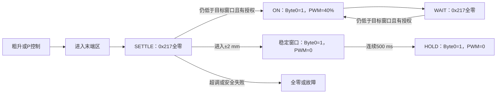

# 末端先停泵与液压保持设计

## 背景与现场证据

首次闭环目标为 `80 mm`。现场 CSV 显示：

- 连续起升从 `46.338 mm` 开始；
- 到 `68.506 mm`、剩余误差 `11.494 mm` 时进入末端脉冲区，但实际输出仍为 `40%`；
- 到 `79.688 mm` 时 `0x217` 才实际归零；
- 停泵后继续上滑 `4.736 mm`，最高达到 `84.424 mm`；
- 等待授权期间约 `16.3 s` 下降 `2.0 mm`，当前全零帧为 `217#0000000000000000`。

根因不是单纯的目标值或 PWM 设定。当前状态机从连续 P 控制进入末端区时，直接把进入时刻当作新脉冲的起点，因此在已有速度和液压惯性的情况下继续通泵约一个响应延迟。随后才停泵，已没有足够的目标余量吸收滑行距离。

## 目标与边界

本次只修改两个直接相关行为：

1. 从粗升或 P 控制进入末端区时，先发送全零帧并完成一次停泵观察，再允许从静止状态发出末端短脉冲。
2. 位置进入目标 `±2 mm` 稳定窗口后，发送 `217#0100000000000000` 保持液压互锁；稳定 `500 ms` 后进入 `hold`，进程存活且全部安全输入正常时继续发送该保持帧。

以下行为明确不变：

- 故障、传感器/CAN 超时、控制循环超时、命令过期、退出和发送线程异常仍发送 `217#0000000000000000`；
- 未取得起升授权时不得发送非零 PWM；
- 自动控制仍然只起升，不自动下降纠偏；
- 超调大于 `2 mm` 但不超过 `5 mm` 时仍判本次失败并全零，超过 `5 mm` 仍锁存故障；
- 标定结果、比例换算、40% 最低稳定 PWM 和下降阀值不变。

## 方案比较

### 方案A：显式末端相位与独立保持命令（采用）

为末端控制增加“首次停泵观察、通泵、停泵观察”三个显式相位。进入末端区永远从停泵观察开始；每次通泵结束也回到停泵观察。另为 `PumpCommand` 增加独立的液压保持构造方法，只在目标稳定窗口和 `hold` 使用。

优点是状态含义清楚，能直接覆盖现场根因，并把正常保持与安全停机的协议语义彻底分开。缺点是状态机多一个内部相位，但可通过单元测试完整覆盖。

### 方案B：把内部目标统一下调一个滑行距离

例如目标 `80 mm` 时按 `75.7 mm` 停泵。实现简单，但滑行随负载、油温、连续通泵时间和机械状态变化；本次实测滑行已经比标定值多 `0.439 mm`。固定补偿不能保证 `±2 mm`，因此不采用。

### 方案C：只缩短末端脉冲

40% 泵的实测响应延迟约 `184 ms`。单纯缩短脉冲可能还没有产生有效位移，且不能消除“带着连续运动速度进入脉冲”的问题，因此不采用。

同时明确拒绝把 `PumpCommand.safe_stop()` 全局改成互锁 `1`：这会让故障和退出路径不再是协议全零，破坏现有安全边界。

## 控制状态与数据流

### 末端相位

- `SETTLE`：发送安全全零，持续 `pulse_wait_s`，让已有液压滑行完成；首次进入末端区必须经过此相位。
- `ON`：在起升死手授权有效时，以最低稳定 PWM 通泵 `pulse_on_s`。
- `WAIT`：脉冲结束后立即发送安全全零并观察 `pulse_wait_s`；观察结束后重新根据实时误差决定保持、失败或下一脉冲。

授权在 `ON` 相位消失时，当前周期立即全零，并把末端序列重置为 `SETTLE`。再次授权时必须先完成停泵观察，禁止把多次键盘事件拼成连续通泵。

### 液压保持

新增语义明确的 `PumpCommand.hydraulic_hold()`：

```text
interlock=True, lift_pwm=0, accel=0, decel=0, lower_valve=0
```

编码后为 `217#0100000000000000`。只有当实时高度处于目标 `±2 mm`、传感器和 CAN 反馈新鲜、无故障且控制循环正常时返回该命令。稳定计时期间状态仍为 `idle`，达到 `500 ms` 后状态为 `hold`。因为保持命令不含运动输出，进入稳定窗口后允许操作者松开 `u`；任何安全门禁失败都会在同一控制周期退回全零。



## 代码边界

- `types.py`
  - 增加 `PumpCommand.hydraulic_hold()`；保留 `safe_stop()` 为严格全零。
- `controller.py`
  - 为末端脉冲增加内部相位；修改 `_automatic_command()` 的首次进入、脉冲和观察转换。
  - 目标稳定窗口和 `HOLD` 返回液压保持命令。
  - 起升授权丢失时重置整个末端序列，而不是只清空时间戳。
- `can_pump.py`
  - 编码规则不变；已有 `interlock=True` 会自然编码为 Byte0 `0x01`。
- `docs/维护地图.md`、`README.md`
  - 记录保持帧与全零安全帧的区别，以及末端首次停泵行为。
- `operator_runtime.py`
  - 在实际输出和期望输出行显示互锁开关，现场无需仅凭状态名猜测 Byte0。

运行调用链保持为：

```text
CLI move → ForegroundRuntime.run() → MoveCommandSource.step()
→ HeightController.step() → _automatic_command()
→ CanPump.update_command() → run_cycle() → encode_pump_command()
→ SocketCAN 0x217
```

## 测试设计

必须先增加失败测试，再修改生产代码：

1. 从 P 控制跨入末端区的首周期必须为严格全零，而不是继续40%通泵。
2. 首次停泵观察结束前不得通泵；结束且仍低于目标时才允许一个短脉冲。
3. 脉冲结束后必须再次全零观察；授权中断会重置为首次停泵观察。
4. 进入目标 `±2 mm` 时编码结果必须为 `217#0100000000000000`，并在 `500 ms` 后进入 `hold`。
5. 稳定窗口内松开 `u` 仍保持 Byte0 `0x01`，但所有安全故障、超时、退出和命令过期测试仍断言全零。
6. TUI 同时显示实际和期望互锁状态，CSV 现有 `command_interlock` 与 `desired_interlock` 字段保持不变。
7. 用现场时序构造回归场景，证明在 `68.506 mm` 进入末端区时不会继续通泵。
8. 运行控制器、CAN、前台运行时定向测试和全量 pytest，并执行 `compileall` 与 `git diff --check`。

## 现场验证顺序

软件测试通过并推送后，现场只执行一次低高度目标测试：

1. 先用 `candump` 确认末端进入时出现全零观察帧；
2. 进入目标窗口后确认帧为 `217#0100000000000000`；
3. 操作者松开 `u`，观察10秒高度变化，验证 Byte0 `0x01` 是否确实锁止；
4. 按 `q` 后确认帧恢复全零并停止发送；
5. 只有稳定误差和退出帧都符合预期，才进行第二、第三次闭环测试。

真实泵对 Byte0 `0x01` 的液压锁止效果仍属于现场验证项；自动化测试只能证明程序在正确状态发送了正确字节，不能替代硬件确认。
