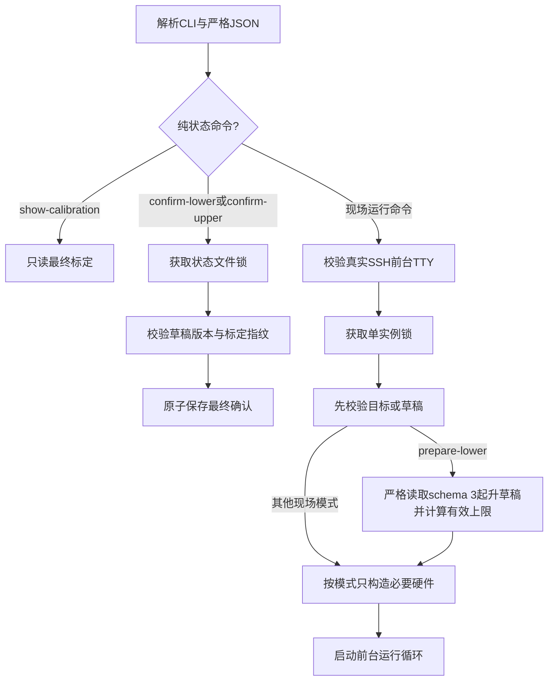
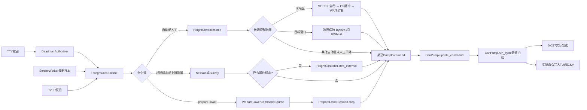
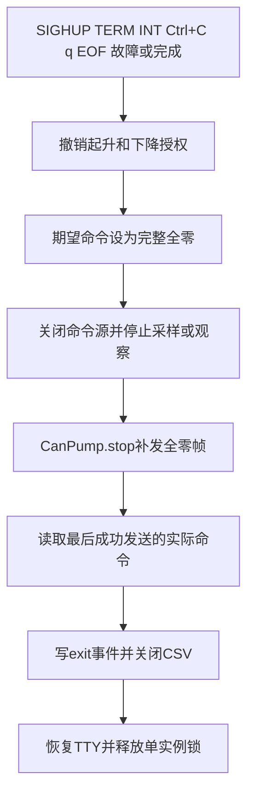

# AGV 升降闭环测试程序维护地图

本文面向后续维护者，说明配置变量、模块职责、主调用链、安全不变量和测试定位。它不替代现场操作说明；实机步骤以根目录 `README.md` 为准。

## 架构边界

程序分成四层：

1. 高度输入层把 RTU 寄存器转换成统一的 `HeightSample`；
2. 标定或控制层只根据样本、反馈和授权生成不可变 `PumpCommand`；
3. `CanPump` 在发送前再次执行命令、反馈和启动窗口门禁；
4. SSH 前台运行层负责真实按键授权、日志、线程、信号和退出归零。

闭环层不得导入 pymodbus 或 python-can。未来 Modbus TCP 只能通过新的 `HeightSource` 进入，不得把 TCP 分支写进 `HeightController`。

## 模块地图

| 文件 | 主要职责 | 不应承担的职责 |
| --- | --- | --- |
| `types.py` | 公共样本、命令、反馈和 `HeightSource` 协议 | 硬件连接和状态机 |
| `config.py` | 严格 JSON 解析、字段类型和安全上限校验 | 创建目录或打开硬件 |
| `modbus_rtu.py` | FC03 读取、双 HR 组合、比例换算、重连 | 控制泵或决定目标 |
| `calibration.py` | 起升/下降试验会话、安全预升会话、结果分析、最终标定包、上限测量 | CAN 线程和 SSH 输入 |
| `controller.py` | 自动起升、P 档位、末端脉冲、保持、人工下降和外部安全仲裁 | 串口、CAN 总线和文件存储 |
| `can_pump.py` | 链路只读校验、冲突预检、50 ms 发送、反馈接收、最终发送门禁 | 修改 `can0` 系统配置 |
| `passive_can.py` | 有界、只接收的 `0x197` 观察 | 发送任何 CAN 帧 |
| `operator_runtime.py` | 非阻塞 TTY、死手授权、传感器线程、信号桥、CSV 和单实例锁 | 选择业务模式 |
| `runtime_storage.py` | 版本化草稿、指纹和原子 JSON 保存；起升草稿 v3 只接受最终净位移语义的三次正式测量 | 驱动硬件 |
| `application.py` | CLI 模式到依赖、会话、控制器和运行循环的编排 | 实现协议细节 |
| `cli.py` | 参数、边界和用户可读错误 | 隐式启动硬件 |
| `simulation.py` | 液压延迟、死区和滑行的确定性仿真 | 生产硬件访问 |

## 关键变量地图

### 传感器

| 变量或字段 | 作用 | 单位 | 默认值或来源 | 有效范围 | 在哪个函数生效 | 修改后的影响 | 验证用例 |
| --- | --- | --- | --- | --- | --- | --- | --- |
| `sensor.port` | 选择串口设备 | 设备路径 | `/dev/ttyS7` | 非空字符串 | `ModbusRtuHeightSource.open()` | 改变实际连接设备；错配会打开失败或读错设备 | `test_config.py::test_load_config_returns_typed_sensor_settings`；设备名仍需实机验证 |
| `baudrate/bytesize/parity/stopbits` | 配置 RTU 帧格式 | bit/s、bit | `115200/8/N/1` | 波特率正整数、数据位 5..8、合法校验、停止位 1..2 | `_create_rtu_client()` | 改变串口帧格式，不改变 HR 换算 | `test_modbus_rtu.py::test_read_sample_combines_high_low_words_and_scales_to_mm` |
| `slave_id` | 选择 Modbus 从站 | 无 | `3` | `1..247` | `_read_holding_registers()` | 改变 FC03 请求目标 | `test_modbus_rtu.py::test_read_sample_supports_low_high_word_order_and_configured_modbus_target` |
| `register_address/register_count` | 选择连续 HR | 寄存器地址、个数 | `0/2` | 地址 `0..65534`、数量固定 `2` | `_read_holding_registers()` | 改变读取起点；v1 不允许单寄存器或多寄存器布局 | `test_modbus_rtu.py::test_read_sample_reads_register_count_from_config_object` |
| `word_order` | 组合两个 16 位 HR | 无 | `high_low` | `high_low` 或 `low_high` | `read_sample()` | 交换高低字，直接改变原始计数 | `test_modbus_rtu.py::test_read_sample_supports_low_high_word_order_and_configured_modbus_target` |
| `wheel_circumference_mm/counts_per_revolution` | 原始计数到高度的比例 | mm、count/rev | `200/4096` | 都为正数 | `read_sample()` | 改变所有高度、速度、目标和限位的物理尺度 | `test_modbus_rtu.py::test_read_sample_combines_high_low_words_and_scales_to_mm` |
| `range_mm` | 推导原始计数上限 | mm | `3000` | 正数 | `read_sample()` | 改变合法原始范围；默认上限为 61440 count | `test_modbus_rtu.py::test_read_sample_accepts_the_inclusive_maximum_count` |
| `poll_period_s` | 高度采样线程周期 | s | `0.02` | 正数 | `SensorWorker._run()` | 改变采样频率；不放宽 100 ms 新鲜度门禁 | `test_foreground_loop.py::test_loop_uses_20ms_period_without_real_sleep` |

### CAN 与泵

| 变量或字段 | 作用 | 单位 | 默认值或来源 | 有效范围 | 在哪个函数生效 | 修改后的影响 | 验证用例 |
| --- | --- | --- | --- | --- | --- | --- | --- |
| `can.interface` | 选择 SocketCAN 接口 | 接口名 | `can0` | 1..15 字节且无空白 | `inspect_can_link()`、`_create_socketcan_bus()`、`_create_receive_bus()` | 改变只读检查和收发接口；驱动工厂显式导入 python-can 子模块，不依赖顶层延迟导出 | `test_can_pump.py::test_inspect_can_link_is_read_only_and_returns_parsed_state`；`test_default_can_factories_import_lazy_python_can_submodules`；`test_default_receive_bus_imports_lazy_python_can_interface_submodule` |
| `can.bitrate` | 核对总线速率 | bit/s | `500000` | 固定 `500000` | `inspect_can_link()` | 只影响启动校验；程序不会设置系统接口 | `test_can_pump.py::test_inspect_can_link_reports_actionable_failures` |
| `command_id/feedback_id/nmt_id` | 选择协议帧 | 11 位 CAN ID | `0x217/0x197/0x000` | 三者分别固定 | `CanPump.run_cycle()`、`_receive_loop()`、`PassiveCanObserver.poll()` | 改变协议路由；当前配置会拒绝任何其他 ID | `test_can_pump.py::test_encode_command_and_nmt_payloads_follow_protocol_layout` |
| `send_period_s` | 独立发送线程周期 | s | `0.05` | 固定 `0.05` | `CanPump._send_loop()` | 改变 `0x217` 刷新节拍 | `test_can_pump.py::test_send_thread_uses_fifty_millisecond_deadlines_and_full_frames` |
| `feedback_timeout_s` | 反馈新鲜度门限 | s | `0.15` | `(0,0.15]` | `select_safe_command()`、`ForegroundRuntime._guard_motion_cycle()` | 超时后全零并终止动作运行 | `test_foreground_loop.py::test_motion_window_end_requires_fresh_fault_free_197_feedback` |
| `command_timeout_s` | 期望命令新鲜度门限 | s | `0.15` | `(0,0.15]` | `select_safe_command()` | 主循环卡住时发送线程独立归零 | `test_can_pump.py::test_safe_policy_fails_closed` |
| `preflight_s` | 外部 `0x217` 冲突监听 | s | `0.3` | `0.3..10` | `CanPump._run_preflight()` | 增减启动前被动监听时间，不能低于 300 ms | `test_can_pump.py::test_preflight_covers_full_window_and_detects_command_at_299ms` |
| `startup_nmt_s` | NMT 后强制全零窗口 | s | `5.0` | `5..60` | `select_safe_command()`、`ForegroundRuntime.run()` | 改变允许动作前的等待；窗口内不得推进会话 | `test_foreground_loop.py::test_startup_nmt_window_does_not_advance_motion_session` |
| `shutdown_zero_frames` | 停机补发零帧数 | frame | `3` | `3..100` | `CanPump._send_shutdown_zero_frames()` | 改变关闭前尽力补发次数 | `test_can_pump.py::test_stop_is_idempotent_and_sends_configured_zero_frames_before_shutdown` |

`PumpCommand` 字段到 `0x217` 的映射：Byte0 bit0 为互锁，Byte1 为起升 PWM，Byte2/3 为加减速，Byte4 为下降比例阀，Byte5..7 为零。

### 控制与安全

| 变量或字段 | 作用 | 单位 | 默认值或来源 | 有效范围 | 在哪个函数生效 | 修改后的影响 | 验证用例 |
| --- | --- | --- | --- | --- | --- | --- | --- |
| `tolerance_mm/stable_time_s` | 定义到位与保持 | mm、s | `2/0.5` | 容差 `(0,2]`、稳定时间 `>=0.5` | `HeightController._automatic_command()` | 改变进入 `hold` 的误差和持续时间 | `test_controller.py::test_target_requires_500ms_continuous_tolerance_before_hold` |
| `overshoot_limit_mm` | 判定本次超调失败 | mm | `5` | `(tolerance,5]` | `_automatic_command()` | 改变超调锁故障门限，不会启用自动下降 | `test_controller.py::test_overshoot_never_auto_lowers_and_faults_only_beyond_limit` |
| `absolute_max_height_mm` | 软件绝对上限 | mm | `2900` | `(0,2900]` | `set_target()`、`_lift_upper_limit_reason()`、标定会话和 Survey | 收紧所有起升路径；不能高于 2900 | `test_controller.py::test_target_requires_effective_soft_limit_and_never_exceeds_absolute_limit` |
| `max_speed_mm_s` | 拒绝位置异常跳变 | mm/s | `1200` | `(0,1200]` | `HeightController._validate_inputs()`、`ForegroundRuntime._guard_height_sample()` | 改变控制和首次标定的速度故障门限 | `test_controller.py::test_adjacent_sample_speed_and_lift_direction_are_guarded` |
| `sensor_timeout_s` | 高度样本新鲜度 | s | `0.1` | `(0,0.1]` | `_validate_inputs()`、`_validate_session_inputs()`、运行时守卫 | 超时后全零并锁存/退出 | `test_controller.py::test_each_input_guard_fails_closed` |
| `control_loop_timeout_s` | 主控制循环 deadline | s | `0.1` | `(0,0.1]` | `HeightController._begin_safety_cycle()`、`ForegroundRuntime.run()` | 主线程阻塞后在继续会话前停机 | `test_foreground_loop.py::test_bootstrap_motion_loop_deadline_gap_locks_stop_before_next_session_step` |
| `current_multiplier/current_duration_s` | 同 PWM 二级过流保护 | 倍数、s | `1.5/0.2` | 倍数 `(1,1.5]`、持续时间 `(0,0.2]` | `HeightController._check_overcurrent()`、`PrepareLowerSession._guard_overcurrent()` | 用有符号泵电流的绝对值与标定峰值比较；改变已有最终标定和schema 3草稿预升的持续过流门限，首次起升标定无此数据 | `test_controller.py::test_same_pwm_overcurrent_must_persist_for_200ms`；`test_calibration.py::test_prepare_lower_overcurrent_must_persist_for_configured_duration` |
| `slow_zone_mm/pulse_zone_mm` | 划分粗升、P控制和末端脉冲区 | mm | `max(50,5×max_coast)` / `max(10,3×max_coast)` | slow 至少 50、pulse 至少 10，构造时保证 slow 大于 pulse | `HeightController.__init__()`、`_automatic_command()` | 标定滑行距离改变时自动改变切区位置 | `test_controller.py::test_control_zones_derive_from_coast_and_use_deterministic_boundaries` |
| `pulse_on_s/pulse_wait_s` | 末端脉冲动作与首次/脉冲后全零观察节拍 | s | `response_delay_s` 与 `stable_time_s` 派生 | 动作 `0.1..0.3`、等待 `0.3..1.0` | `HeightController.__init__()`、`_terminal_pulse_command()` | 标定响应延迟改变时调整末端逼近节拍；进入末端区必须先完成一次等待 | `test_controller.py::test_terminal_pulse_settles_before_first_on_and_waits_after_each_pulse`；`test_field_transition_from_continuous_lift_stops_before_terminal_pulse` |
| `_terminal_pulse_phase` | 区分首次停泵、通泵和脉冲后观察 | 状态 | 初始化和重置为 `None` | `None/SETTLE/ON/WAIT` | `_terminal_pulse_command()`、`_reset_terminal_pulse()` | 决定本周期为严格全零还是最低稳定PWM；通泵中撤权会重置并强制重新观察 | `test_controller.py::test_terminal_authorization_loss_restarts_with_full_settle` |
| `PumpCommand.interlock` | 区分正常液压保持和安全停机 | bool / `0x217 Byte0` | `hydraulic_hold()` 为 `True`；`safe_stop()` 为 `False` | `False/True` | `_automatic_command()`、`encode_pump_command()` | 目标稳定窗口发送 `01 00 00 00 00 00 00 00`；故障、超时和退出保持全零 | `test_types.py::test_hydraulic_hold_enables_only_interlock_and_safe_stop_remains_all_zero`；`test_can_pump.py::test_encode_command_and_nmt_payloads_follow_protocol_layout`；`test_controller.py::test_hydraulic_hold_fails_to_all_zero_on_sensor_fault` |
| `direction_tolerance_mm` | 累计反向容差 | mm | `1` | `(0,2]` | 控制器方向守卫、`LiftCalibrationSession.step()`、`LowerCalibrationSession.step()`、`PrepareLowerSession._guard_direction()` | 改变所有起升、下降和预升会话的反向锁故障灵敏度 | `test_calibration.py::test_lift_session_immediately_latches_reverse_motion_during_active_pulse`；`test_prepare_lower_latches_reverse_motion` |
| `survey_max_on_s/survey_pause_s` | 上限测量动作与暂停 | s | `1.0/0.5` | 动作 `(0,1]`、暂停正数 | `UpperLimitSurvey.step()` | 改变单次连续起升和强制等待 | `test_upper_limit_survey.py::test_survey_limits_each_lift_segment_to_one_second_then_pauses` |

### 起升标定与 SSH 显示

| 变量或字段 | 作用 | 单位 | 默认值或来源 | 有效范围 | 在哪个函数生效 | 修改后的影响 | 验证用例 |
| --- | --- | --- | --- | --- | --- | --- | --- |
| `LIFT_CALIBRATION_PWM` | 预充压、正式测量和成功结果的唯一 PWM | % | `40` | 固定 40 | `LiftCalibrationSession._current_pwm()`、`analyze_lift_trials()` | 改变四个现场动作以及新标定包的最小/粗升档；不能单独修改而不重做实机标定 | `test_calibration.py::test_lift_analysis_accepts_delayed_settled_displacement`；`test_controller.py::test_single_level_calibration_never_commands_above_40` |
| `LIFT_PRECHARGE_REPEATS` | 最低位正式测量前的建压周期数 | cycle | `1` | 固定 1 | `LiftCalibrationSession.done`、`_finish()` | 改变不写入 `LiftTrial` 的预充压动作数；每个周期仍受临时上限和统一运行门禁保护 | `test_calibration.py::test_lift_session_precharges_then_records_three_delayed_measurements` |
| `LIFT_CALIBRATION_REPEATS` | 预充压后的正式测量次数 | trial | `3` | 固定 3 | `LiftCalibrationSession.done`、`LIFT_CALIBRATION_PLAN` | 改变完成条件和起升草稿的正式样本数；旧 schema 不会自动迁移 | `test_calibration.py::test_lift_session_precharges_then_records_three_delayed_measurements`；`test_operator_runtime.py::test_calibration_draft_roundtrip_preserves_complete_trials` |
| `LIFT_PULSE_S` | 预充压和正式测量的单次通电时间 | s | `0.100` | 固定 0.100 | `LiftCalibrationSession.step()`、`_finish()` | 改变每次机械能量、等效速度分母和硬件风险；不再单独作为运动响应搜索窗口 | `test_calibration.py::test_lift_session_precharges_then_records_three_delayed_measurements` |
| `LIFT_SETTLE_S` | 停泵后全零观察时间 | s | `0.700` | 固定 0.700 | `LIFT_TRIAL_S`、`LiftCalibrationSession.step()` | 与通电组成完整 800 ms 响应搜索；改变最终净位移和停泵上滑观测窗口 | `test_calibration.py::test_lift_session_precharges_then_records_three_delayed_measurements`；`test_lift_session_authorization_loss_during_settle_keeps_completed_pulse` |
| `LIFT_MAX_RESPONSE_DELAY_S` | 正式样本可供闭环使用的最大首次运动延迟 | s | `0.300` | `(0,0.300]` | `LiftCalibrationSession._finish()`、`analyze_lift_trials()` | 收紧会拒绝慢响应机构；放宽超过 300 ms 会与控制器末端脉冲上限矛盾 | `test_calibration.py::test_lift_analysis_rejects_response_later_than_controller_limit` |
| `_precharge_count` | 已完成且不生成正式样本的预充压数 | cycle | 会话初始化为 `0` | `0..1` | `LiftCalibrationSession.done`、`_finish()` | 决定当前周期是预充压还是写入 `LiftTrial`；不会直接发送硬件命令 | `test_calibration.py::test_lift_session_precharges_then_records_three_delayed_measurements` |
| `_awaiting_authorization_release` | 阻止同一700 ms租约连续启动两个周期 | bool | 会话初始化为 `False` | `False/True` | `LiftCalibrationSession.step()`、`_finish()` | 周期结束后必须先观察到撤权，再接受新的 `u` 授权 | `test_calibration.py::test_lift_session_requires_release_before_every_new_cycle` |
| `LiftTrial.displacement_mm` | 正式样本在观察结束仍保留的净起升量 | mm | `final_height-start_height` | 通过条件 `>=1` | `LiftCalibrationSession._finish()`、`analyze_lift_trials()` | 决定40%是否能可靠起升；不再表示100 ms边界的通电位移 | `test_calibration.py::test_lift_session_precharges_then_records_three_delayed_measurements` |
| `LiftTrial.start_delay_s` | 通电开始到完整周期内首次正向0.1 mm运动的时间 | s | 高度样本时间戳差 | 记录 `0..0.8`，通过条件 `<=0.3` | `LiftCalibrationSession._observe_motion()`、`_finish()`、`analyze_lift_trials()` | 决定末端脉冲和等待时长；不得静默截断 | `test_calibration.py::test_lift_session_precharges_then_records_three_delayed_measurements`；`test_lift_analysis_rejects_response_later_than_controller_limit` |
| `LiftTrial.coast_mm` | 全零命令后700 ms内相对停泵边界的最大上滑 | mm | `highest_settle-stop_height` | `>=0` | `LiftCalibrationSession.step()`、`_finish()` | 改变控制器 slow zone 和 pulse zone，避免把延迟运动漏出滑行量 | `test_calibration.py::test_lift_session_precharges_then_records_three_delayed_measurements`；`test_controller.py::test_control_zones_derive_from_coast_and_use_deterministic_boundaries` |
| `DRAFT_SCHEMA_VERSION` | 起升动作草稿格式 | 版本号 | `3` | 当前只支持 3 | `CalibrationDraftStore.save_lift()/load_lift()` | v1的27次动作和v2的通电位移语义都明确拒绝，防止旧数据混入新闭环参数 | `test_operator_runtime.py::test_calibration_draft_rejects_old_lift_semantics` |
| `loop_period_s` | 前台安全控制周期 | s | `0.020` | `(0,0.1]` | `ForegroundRuntime.run()` | 改变命令源、安全门禁和 CSV 周期；不改变 CAN 独立 50 ms 发送周期 | `test_foreground_loop.py::test_loop_uses_20ms_period_without_real_sleep` |
| `render_period_s` | SSH TUI 刷新周期 | s | `0.200` | `(0,1]` | `ForegroundRuntime.run()` | 只改变显示频率，不降低 20 ms 控制、安全检查或日志频率 | `test_foreground_loop.py::test_foreground_runtime_controls_at_50hz_but_renders_about_5hz` |

### 下降标定前安全预升

| 变量或字段 | 作用 | 单位 | 默认值或来源 | 有效范围 | 在哪个函数生效 | 修改后的影响 | 验证用例 |
| --- | --- | --- | --- | --- | --- | --- | --- |
| `PREPARE_LOWER_PULSE_S` | 单次预升通泵时间 | s | 固定 `0.100` | 固定0.100 | `PrepareLowerSession._advance_pulse()` | 改变每次40%动作能量；必须与草稿实测脉冲语义一致 | `test_calibration.py::test_prepare_lower_uses_40_percent_100ms_pulses_and_700ms_settle` |
| `PREPARE_LOWER_SETTLE_S` | 每次通泵后的强制全零观察 | s | 固定 `0.700` | 固定0.700 | `_enter_settle()`、`_advance_settle()` | 改变延迟运动和停泵上滑观察窗口；授权中断也不能绕过 | `test_calibration.py::test_prepare_lower_authorization_loss_stops_and_cannot_bypass_settle` |
| `target_mm` | 为下降标定准备的传感器相对高度目标 | mm | `prepare-lower --target-mm` | `0.001..2900`，且必须高于启动高度 | `PrepareLowerSession.__init__()/step()` | 改变完成高度；达到后只归零退出，不进入保持 | `test_calibration.py::test_prepare_lower_completes_at_target_and_never_commands_lower_valve`；`test_prepare_lower_rejects_target_not_above_initial_height` |
| `effective_max_height_mm` | 预升的实际硬上限 | mm | 临时上限、持久软限位、配置绝对上限和2900的最小值 | 必须大于 `target_mm + max_coast_mm` | `_build_control_source()`、`PrepareLowerSession._guard_hard_limit()` | 收紧会拒绝不留上滑余量的目标，触达上限优先判故障而非成功 | `test_application_modes.py::test_prepare_lower_effective_limit_uses_persistent_soft_limit`；`test_calibration.py::test_prepare_lower_faults_at_effective_hard_limit_before_success` |
| `_pwm` | 安全预升唯一输出PWM | % | schema 3起升草稿的 `min_stable_pwm`，本次为40 | `1..100`，当前有效草稿固定40 | `_wait_or_start()`、`_advance_pulse()` | 改变实际0x217起升输出；不允许命令行覆盖或自动升档 | `test_application_modes.py::test_prepare_lower_builds_from_draft_without_final_bundle`；`test_calibration.py::test_prepare_lower_uses_40_percent_100ms_pulses_and_700ms_settle` |
| `_overcurrent_threshold` | 预升持续过流阈值 | 0x197电流raw | 草稿同PWM峰值 × `current_multiplier`；现场为 `1112×1.5=1668` | 正数 | `_guard_overcurrent()` | 连续超过阈值达到配置时长时锁故障；按有符号电流绝对值比较 | `test_calibration.py::test_prepare_lower_overcurrent_must_persist_for_configured_duration` |

### 运行快照与日志

| 变量或字段 | 作用 | 单位 | 默认值或来源 | 有效范围 | 写入者与读取者 | 修改后的影响 | 验证用例 |
| --- | --- | --- | --- | --- | --- | --- | --- |
| `RuntimeSnapshot.command` | 最后成功发送的实际命令 | 协议原始值 | `CanPump.last_sent_command` | 合法 `PumpCommand` | `ForegroundRuntime._snapshot()` 写；TUI/CSV 读 | 影响现场审计，不能用期望值代替 | `test_foreground_loop.py::test_csv_and_tui_snapshot_use_can_pump_last_sent_command_not_desired` |
| `desired_command` | 控制层最新请求 | 协议原始值 | 命令源输出 | 合法 `PumpCommand` | 主循环写；TUI/CSV 读 | 用于解释门控前后差异，不代表已发送 | `test_foreground_loop.py::test_q_event_records_last_successful_actual_separately_from_requested_zero` |
| `zero_requested` | 表示已请求全零 | bool | 运行时退出/故障路径 | `true/false` | 退出/故障分支经 `_refresh_event_snapshot()` 写；CSV 读 | 只表达请求，不能证明 CAN 成功 | 同上 |
| `lift/lower_remaining_ms` | 死手授权倒计时 | ms | `DeadmanAuthorizer` | 起升 `0..700`、下降 `0..150` | 按键续期写；命令源/TUI/CSV 读 | 决定对应方向能否产生非零命令 | `test_operator_runtime.py::test_deadman_authorizations_have_independent_exact_boundaries` |
| `pump_fault/controller_fault` | 区分发送门控与控制锁存原因 | 文本或空 | CAN 泵、控制器 | 空或首个故障原因 | 运行循环采集；TUI/CSV/CLI 读 | 影响停机原因和现场排查 | `test_foreground_loop.py::test_signal_and_controller_fault_are_logged_as_distinct_events` |
| `SignalShutdownFlag` 待处理原因 | 信号处理器无锁停机桥 | 信号号文本 | SIGHUP/TERM/INT handler | 空或 `signal:<n>` | handler 写简单属性；主循环用 `consume()` 首步消费 | 保证信号不在普通锁内死锁 | `test_foreground_loop.py::test_signal_handler_never_touches_locked_latch_and_loop_stops_safely` |

### 协议中间值

| 变量或字段 | 作用 | 单位 | 默认值或来源 | 有效范围 | 在哪个函数生效 | 修改后的影响 | 验证用例 |
| --- | --- | --- | --- | --- | --- | --- | --- |
| `raw_count` | 两个 HR 的 32 位组合值 | count | HR0/HR1 | 默认 `0..61440` | `ModbusRtuHeightSource.read_sample()` | 决定高度并参与原始范围审计 | `test_modbus_rtu.py::test_read_sample_combines_high_low_words_and_scales_to_mm` |
| `height_mm` | 从传感器零点开始的相对起升行程，不是平台离地绝对高度 | mm | `raw×轮周长/每圈计数` | `0..range_mm` | `read_sample()` 生成；控制器/标定器读取 | 影响目标、速度、方向和全部限位；不得在控制层叠加安装偏置 | 同上 |
| `0x217 Byte0..7` | 泵命令线格式 | byte | `PumpCommand` | 每字段 0..255，保留字节为零 | `encode_pump_command()` | 改变泵互锁、PWM、坡度和下降阀输出 | `test_can_pump.py::test_encode_command_and_nmt_payloads_follow_protocol_layout` |
| `0x197 Byte3..7` | 泵反馈线格式 | Byte3..4 有符号电流原始值、Byte5 故障码、Byte7 下降电流原始值 | CAN 帧 | 电机电流 `-32768..32767`；故障码及下降电流 `0..255`；固定 8 字节标准帧 | `parse_pump_feedback()` 解析；标定会话和 `HeightController` 消费 | TUI/CSV保留电流正负号；标定峰值及过流保护使用绝对值，避免传感器极性导致保护失效 | `test_can_pump.py::test_parse_feedback_treats_motor_current_as_signed_16_bit`；`test_calibration.py::test_lift_session_accepts_signed_current_and_records_peak_magnitude`；`test_controller.py::test_negative_polarity_overcurrent_uses_current_magnitude` |

## 函数地图

| 函数 | 谁触发或调用 | 主要作用 | 调用的类内函数 | 大概逻辑 | 状态或硬件副作用 | 失败行为 | 验证用例 |
| --- | --- | --- | --- | --- | --- | --- | --- |
| `run_application()` | `python -m ...` 的 `cli.main()` | 按命令选择纯状态或现场路径 | `_run_confirmation()`、`_run_mode()` | 配置校验 → 前置草稿/TTY门禁 → 锁 → 构造最少依赖 | 可能创建锁和运行资源；纯查询/确认不打开硬件 | 已知错误上抛给 CLI 转中文返回码 2 | `test_application_modes.py::test_monitor_constructs_sensor_only_and_never_constructs_can` |
| `_run_confirmation()` | `confirm-lower/confirm-upper` | 动作后确认草稿 | 各 Store 的 `load()/save()`、指纹函数 | 加载当前标定 → 比对指纹 → 校验选择 → 原子保存 | 只写状态 JSON，不打开 TTY/串口/CAN | 旧 schema、指纹不符或越界时拒绝 | `test_application_modes.py::test_confirm_lower_rejects_when_lift_draft_changed_after_lower_measurement` |
| `ForegroundRuntime.run()` | `_run_mode()` 的 SSH 前台主线程 | 统一资源、按键、时序、门禁、TUI和日志 | `_handle_event()`、`_guard_motion_cycle()`、`_guard_height_sample()`、`_safe_cleanup()` | 启动 → 首步消费信号 → 读取采样/反馈快照 → 取本周期单调时间 → 守卫 → 命令源 → 更新泵 → 记录 → 到期才渲染 | 启停采样/CAN线程、每 20 ms 写 CSV/更新期望命令，约每 200 ms 刷新 TUI | 任一异常先撤权和归零，再保留首个根因；异步快照不会被旧 `now` 误判为未来 | `test_foreground_loop.py::test_worker_tui_and_logger_errors_zero_before_stop`；`test_runtime_timestamps_cycle_after_reading_concurrent_can_snapshot`；`test_foreground_runtime_controls_at_50hz_but_renders_about_5hz` |
| `PosixAnsiTerminal.render()` | `ForegroundRuntime.run()` 约每 200 ms | 把运行快照刷新到 SSH ANSI 终端 | `_show()`、`_show_fault_code()`、`_write_text()` | 构造含实际/期望互锁的完整画面 → 单次非阻塞完整帧写入 → 阻塞或部分写入直接丢帧 → 下一帧从左上角重绘 | 尽力写 stdout；不操作串口或 CAN；关闭时立即恢复 termios 和原 blocking 状态 | `BlockingIOError` 和部分帧只计数丢弃；其他写错误由主循环按故障路径撤权归零 | `test_operator_runtime.py::test_tui_render_shows_actual_and_desired_interlock_state`；`test_tui_render_clears_every_line_before_writing_shorter_values`；`test_posix_terminal_drops_blocked_frame_and_restores_terminal`；`test_posix_terminal_drops_partial_frame_and_next_render_is_complete` |
| `HeightController.step()` | 自动 `move` 或 `manual-lower` 命令源 | 普通闭环与人工下降仲裁 | `_begin_safety_cycle()`、`_automatic_command()`、`_record_actual_command()` | 输入门禁 → 电流幅值过流检查 → 故障处理 → 状态机 → 运动授权门控 | 更新状态、故障、方向、末端相位和过流历史；目标窗口可返回零PWM液压保持，无直接硬件 I/O | 门禁失败时返回严格全零并锁存故障 | `test_controller.py::test_each_input_guard_fails_closed`；`test_target_requires_500ms_continuous_tolerance_before_hold`；`test_hydraulic_hold_fails_to_all_zero_on_sensor_fault` |
| `HeightController._automatic_command()` / `_terminal_pulse_command()` | `HeightController.step()` 的自动目标分支 | 切分控制区并生成末端相位命令 | `_reset_terminal_pulse()`、`_lift_command()` | 粗升/P控制 → 首次 `SETTLE` 全零 → `ON` 短脉冲 → `WAIT` 全零 → 重新按实时误差决策；目标窗口返回液压保持 | 只生成不可变 `PumpCommand`；由 `CanPump` 异步写 `0x217` | 超调失败全零；超过5 mm或任一安全门禁锁故障全零 | `test_controller.py::test_field_transition_from_continuous_lift_stops_before_terminal_pulse`；`test_terminal_pulse_settles_before_first_on_and_waits_after_each_pulse`；`test_overshoot_never_auto_lowers_and_faults_only_beyond_limit` |
| `HeightController.step_external()` | 已有标定后的重标定和 Survey 命令源 | 给外部期望命令复用同一安全门禁 | `_begin_safety_cycle()`、`_external_plan_reason()`、方向/过流检查 | 校验外部模式和计划 → 安全门禁 → 授权 → 返回唯一实际命令 | 更新控制器安全历史；无直接硬件 I/O | 计划外命令或门禁失败时全零/故障 | `test_controller.py::test_step_external_rejects_commands_outside_mode_measurement_plan` |
| `CanPump.start()` | `ForegroundRuntime.run()` | 只读链路检查、冲突预检并启动双线程 | `_run_preflight()`、`run_cycle()` | 检查链路 → 显式导入 `can.interface.Bus` 打开总线 → 被动监听 → 首次NMT/零 → 启动收发线程 | 打开 SocketCAN、发送 NMT/零、创建线程 | 导入、打开或线程失败时事务式回滚、补零、关闭并拒绝不安全重启 | `test_can_pump.py::test_thread_start_failure_rolls_back_bus_and_started_thread`；`test_default_can_factories_import_lazy_python_can_submodules` |
| `CanPump.run_cycle()` | 启动路径和 50 ms 发送线程 | 选择并发送最终实际命令 | `select_safe_command()`、`_send_payload()` | 读取原子状态快照 → 默认在快照后取单调时间 → 全部门禁 → 必要时NMT → 发送完整0x217 → 更新actual | 写 CAN；成功后更新 `last_sent_command` | 发送异常交给线程故障清理并保持全零策略；真实超时/未来时间仍失败关闭 | `test_can_pump.py::test_run_cycle_keeps_zero_during_five_second_window_then_allows_fresh_command`；`test_run_cycle_timestamps_after_atomic_feedback_snapshot`；`test_send_thread_leaves_snapshot_timestamping_to_run_cycle` |
| `CanPump.stop()` | 正常、异常和上下文退出 | 有界停止线程并补发零帧 | `_send_shutdown_zero_frames()`、`_close_bus()` | 设停止标记 → join → 加锁补零 → 关闭总线 → 清状态 | 写多帧全零并关闭 SocketCAN | 线程未退出时保留故障和代际，拒绝盲目重启 | `test_can_pump.py::test_stop_join_timeout_retains_old_thread_and_rejects_restart_before_bus_open` |
| `LiftCalibrationSession.step()` | 起升标定命令源每 20 ms | 执行一次预充压和三次固定40%正式测量 | `_begin()`、`_observe_powered()`、`_observe_motion()`、`_finish()`、`_fail()` | 新授权 → 100 ms通电采集电流 → 700 ms全零搜索运动/上滑 → 预充压或记录最终净位移 → 等待撤权 → 下一授权 | 只更新会话并返回期望命令；无直接I/O；预充压仍通过运行时发送到CAN并写CSV | 通电期撤权丢弃当前周期；完整周期反向或门禁失败锁存并永久全零；正式样本延迟大于300 ms时分析拒绝保存 | `test_calibration.py::test_lift_session_precharges_then_records_three_delayed_measurements`；`test_lift_session_requires_release_before_every_new_cycle`；`test_lift_session_checks_reverse_motion_during_settle`；`test_lift_session_accepts_signed_current_and_records_peak_magnitude` |
| `PrepareLowerSession.step()` | `PrepareLowerCommandSource` 每20 ms | 用起升草稿最低稳定PWM准备下降行程 | `_initialize_start_height()`、`_guard_hard_limit()`、`_guard_direction()`、`_guard_overcurrent()`、`_wait_or_start()`、`_advance_pulse()`、`_advance_settle()` | 输入门禁 → 目标/上限/方向/过流 → 100 ms脉冲 → 700 ms全零观察 → 重复至目标 | 只更新会话并返回期望命令，无直接I/O；状态经命令源进入TUI/CSV | 任一门禁失败锁存 `FAULT` 并永久全零；授权中断立即零且仍完成观察 | `test_calibration.py::test_prepare_lower_uses_40_percent_100ms_pulses_and_700ms_settle`；`test_prepare_lower_overcurrent_must_persist_for_configured_duration` |
| `PrepareLowerCommandSource.step()` | `ForegroundRuntime.run()` 在NMT窗口结束后调用 | 把预升会话适配为统一 `CommandDecision` | `PrepareLowerSession.step()` | 缺样本/反馈时零 → 会话步进 → 映射完成或致命原因 | 无直接I/O；只把命令交给运行时更新 `CanPump` | 会话失败作为 `fatal_reason` 触发运行时撤权和归零 | `test_application_modes.py::test_prepare_lower_builds_from_draft_without_final_bundle`；`test_foreground_loop.py::test_prepare_lower_status_source_populates_target_state_and_fault_snapshot` |
| `LowerCalibrationSession.step()` | 下降标定命令源每周期 | 执行 `0x10..0xA0` 阀值试验 | `_begin()`、`_fail()` | 门禁 → 150 ms下降 → 700 ms观察 → 记录候选 | 更新会话并返回下降命令；无直接 I/O | 撤权立即零，异常锁存失败 | `test_calibration.py::test_lower_session_uses_150ms_pulse_and_700ms_observation` |
| `UpperLimitSurvey.step()` | `survey-upper` 命令源每周期 | 最低稳定 PWM 的受限上限测量 | `_validate_survey_sample()` | 门禁 → 最长1秒动作 → 强制暂停 → 更新最高观测 | 更新测量状态并返回起升/零命令 | 样本、时钟或限位异常时结束并锁存失败 | `test_upper_limit_survey.py::test_survey_authorization_toggle_cannot_bypass_mandatory_pause` |
| `ModbusRtuHeightSource.read_sample()` | `SensorWorker` 后台线程 | FC03读取并生成统一样本 | `_read_holding_registers()`、`_invalid()` | 读取两HR → 字序组合 → 范围 → 比例换算 | 读串口、更新兼容签名缓存；无泵副作用 | 返回带错误的无效样本；I/O异常关闭客户端以便重连 | `test_modbus_rtu.py::test_read_exception_closes_client_and_allows_open_to_reconnect` |
| `PassiveCanObserver.start()/poll()` | `observe-can` 前台循环 | 显式导入 `can.interface.Bus` 打开只读总线，并有界接收0x197 | `_create_receive_bus()`、`parse_pump_feedback()` | 精确过滤标准0x197 → 单轮最多64帧或2ms → 忽略噪声 → 返回最新反馈 | 只读 CAN，不发送 | 导入/打开失败立即退出；接收异常保存错误；持续噪声也有界返回 | `test_foreground_loop.py::test_default_receive_bus_imports_lazy_python_can_interface_submodule`；`test_passive_can_poll_returns_after_bounded_continuous_noise_then_reads_feedback` |

## 主启动流程

确认命令必须在 TTY、日志、串口和 CAN 工厂之前返回。`monitor` 不得构造 CAN；`observe-can` 不得构造发送器；`zero-can` 不得构造传感器。

## 动作命令调用链

首次标定和 `prepare-lower` 没有最终 `CalibrationBundle`，因此 `controller=None`，但各自会话门禁与 `ForegroundRuntime` 的控制循环、样本速度和 CAN 反馈门禁仍同时生效。`prepare-lower` 只读取schema 3起升草稿，不写任何标定文件。已有标定后的重标定必须经过 `step_external()`，详见 `外部命令安全仲裁.md`。

## 退出流程

Python 信号处理器只能写 `SignalShutdownFlag` 的简单属性，不能调用带锁的 `ShutdownLatch.request()`、`Event.set()`、日志或硬件方法。主循环每轮首先消费信号标记，再进入普通锁存和归零路径。

## 关键函数卡

以下短卡用于快速理解高风险逻辑；触发者、内部调用、状态/硬件副作用、失败行为和精确测试见上方函数地图，避免在两处重复后发生漂移。

### `run_application()`

- 输入：CLI 参数和可注入依赖。
- 前置：配置必须严格通过；确认命令只访问状态文件。
- 输出：成功返回 0，已知现场错误由 CLI 转成中文错误和返回码 2。
- 不变量：任何硬件工厂都不能早于对应目标、草稿和 TTY 门禁。
- 主要测试：`test_cli_application.py`、`test_application_modes.py`。

### `ForegroundRuntime.run()`

- 输入：命令源、可选运行时长和依赖对象。
- 职责：启动资源、消费信号/按键、先读异步快照再取本周期时间、每 20 ms 统一执行 deadline/样本速度/CAN 反馈门禁、刷新命令并记录，约每 200 ms 才渲染 TUI。
- 不变量：显示降频不降低安全循环频率；5 秒启动窗口不推进动作会话；异步快照不得被旧时间误判为未来；事件日志不把“期望全零”伪报为“已发送全零”；清理路径先撤权和请求零。
- 主要测试：`test_foreground_loop.py`、`test_operator_runtime.py`。

### `HeightController.step()` 与 `step_external()`

- 输入：单调时间、同周期高度样本、泵反馈、授权和期望命令。
- 职责：输入门禁、故障锁存、方向/过流/上限检查和状态机。
- 不变量：自动目标只起升；没有运动授权时PWM和下降阀必须为零；目标稳定窗口可保持 Byte0 为1；外部模式下普通 `step()` 永远返回全零。
- 主要测试：`test_controller.py`，其中普通控制、安全门禁和外部模式分别成组覆盖。

### `CanPump.run_cycle()`

- 输入：最新期望命令；后台发送默认在原子状态快照后自行读取本机单调时间，显式时间仅供启动首周期和确定性测试。
- 职责：按启动窗口、命令新鲜度、反馈新鲜度、反馈故障和线程故障选择实际命令，发送 NMT 和完整 `0x217`。
- 不变量：`last_sent_command` 只在 `0x217` 成功发送后更新；异步反馈快照和默认时间保持因果顺序；任何门禁失败都发送完整全零。
- 主要测试：`test_can_pump.py`，其中纯策略、预检、线程生命周期和运行发送分别成组覆盖。

### `LiftCalibrationSession` 与 `LowerCalibrationSession`

- 输入：样本、反馈和各自独立的死手授权。
- 职责：起升先执行一次 `40% × 100 ms` 预充压，再生成三次同档正式测量；每次全零观察 700 ms，并在完整 800 ms 内记录首次运动、最终净位移和停泵上滑。下降保持独立阀值序列。
- 不变量：预充压不写入 `LiftTrial`；每个周期必须撤权后重新授权；通电期撤权丢弃未完成周期，观察期撤权保留周期；输入无效、完整周期反向或越界时全零；40% 不稳定时不自动提高 PWM；失败会话不能继续放行。
- 主要测试：`test_calibration.py`。

### `PrepareLowerSession.step()`

- 输入：20 ms单调时间、新鲜高度样本、新鲜无故障0x197反馈和起升死手授权；长度单位为mm，时间单位为秒。
- 职责：从schema 3起升草稿读取最低稳定PWM和同档峰值电流，执行100 ms起升、700 ms全零观察，直到达到预升目标。
- 内部调用：`_initialize_start_height()`、`_guard_hard_limit()`、`_guard_direction()`、`_guard_overcurrent()`、`_wait_or_start()`、`_advance_pulse()`、`_advance_settle()`、`_fail()`。
- 状态和硬件副作用：只更新 `WAIT_AUTH/PULSE/SETTLE/DONE/FAULT` 并返回不可变 `PumpCommand`；由前台运行时和CanPump异步产生实际CAN副作用。
- 失败行为：目标不高于启动高度、未留上滑空间、触达有效上限、反向、持续过流或输入异常都会锁存 `FAULT` 并持续返回全零；不提供清故障后继续动作。
- 主要测试：`test_calibration.py` 的全部 `test_prepare_lower_*` 用例，以及 `test_application_modes.py::test_prepare_lower_reports_completion_without_rewriting_lift_draft`。

### 草稿存储与确认

- `CalibrationDraftStore` 以 schema v3 保存三次最终净位移语义的正式起升结果，并拒绝旧 v1 的 27 次动作和 v2 的通电位移草稿；
- `LowerCalibrationDraftStore` 保存下降结果和完整起升结果指纹；
- `SurveyDraftStore` 保存最高观测、建议值和最终标定包指纹；
- `_atomic_json_save()` 使用同目录临时文件和替换，避免半写文件；
- `confirm-lower` 与 `confirm-upper` 在指纹不匹配、旧 schema、未知字段或越界时拒绝。

主要测试位于 `test_operator_runtime.py` 和 `test_application_modes.py`。

## 状态机地图

| 当前状态 | 进入条件 | 正常下一状态 |
| --- | --- | --- |
| `monitor` | 尚未请求动作 | 加载目标后进入 `idle` |
| `idle` | 最终标定和目标已准备，或正在目标窗口内计时 | 大误差且有 `u` 授权时进入控制区；目标窗口内发送互锁保持并在500 ms后进入 `hold` |
| `coarse_lift` | 误差大于 slow zone | 进入 slow zone 后转 `p_control` |
| `p_control` | 位于 slow zone | 进入 pulse zone 后转 `terminal_pulse` |
| `terminal_pulse` | 位于末端区 | 首次 `SETTLE` 全零 → `ON` 短脉冲 → `WAIT` 全零；进入 ±2 mm 后转 `idle` 稳定计时 |
| `hold` | 连续 500 ms 位于目标 ±2 mm | 持续发送 `217#0100000000000000`；目标下方并重新授权时回到控制区 |
| `manual_lower` | 人工下降模式且有 `d` 授权 | 撤权后输出全零并等待 |
| `fault` | 任一安全门禁失败 | 条件恢复且明确请求清除后回到空闲状态 |
| `prepare-lower: WAIT_AUTH` | schema 3草稿、目标和上限已验证 | 有 `u` 授权后进入 `PULSE` |
| `prepare-lower: PULSE` | 新的完整短脉冲开始 | 100 ms到期或撤权后进入 `SETTLE`；达到目标转 `DONE` |
| `prepare-lower: SETTLE` | 通泵结束或中途撤权 | 700 ms全零观察结束后回 `WAIT_AUTH`；达到目标转 `DONE` |
| `prepare-lower: DONE` | 至少开始过一次脉冲且高度达到目标 | 持续全零并由运行时以 `completed` 退出 |
| `prepare-lower: FAULT` | 输入、方向、上限或过流门禁失败 | 持续全零并由运行时按致命原因退出 |

标定和 `survey` 是外部模式，不与普通自动状态同时拥有命令源。

## 测试地图

| 测试文件 | 覆盖重点 |
| --- | --- |
| `test_modbus_rtu.py`、`test_config.py` | HR 组合、比例、pymodbus API、严格配置和失败重连 |
| `test_can_pump.py` | 帧编解码、50 ms 调度、冲突、NMT、反馈、线程、归零和 python-can 延迟导出兼容 |
| `test_calibration.py` | 起升/下降序列、安全预升脉冲与观察、分析、方向、超时、越界、过流和最终标定存储 |
| `test_controller.py` | 粗升、P 档、末端脉冲、保持、超调、方向、过流和外部安全仲裁 |
| `test_upper_limit_survey.py` | 上限测量的单次时长、强制暂停、撤权、越界和建议公式 |
| `test_simulation.py` | 液压延迟、最小 PWM 死区、滑行、误差和超调 |
| `test_foreground_loop.py`、`test_operator_runtime.py` | SSH 死手、信号、EOF、deadline、速度、CSV、锁和退出 |
| `test_application_modes.py`、`test_cli_application.py` | 各模式硬件隔离、预升草稿只读与有效上限、草稿确认、前置失败和 CLI |
| `test_repository_files.py` | 运行数据忽略规则和 RTU 串口传输依赖声明 |

增加安全逻辑时，测试至少要包含：正常路径、门限前一刻、门限时刻、门限后一刻、时间戳回退、无效值和退出清理。

## 修改入口

### 更换 RTU 地址或比例

优先只改实际配置文件。若协议仍是两个 16 位 HR，闭环层无需修改。若寄存器布局改变，先扩展 `modbus_rtu.py` 的纯组合逻辑及测试，再接硬件。

### 新增 Modbus TCP

新增 `ModbusTcpHeightSource`，实现 `HeightSource`；把 `SensorConfig` 改为严格、可判别的 RTU/TCP 配置；只在 `default_dependencies().source_factory` 选择实现。不得修改 `HeightController`、标定会话或 `CanPump` 来识别 TCP。

### 修改泵协议

先修改 `encode_pump_command()` 或 `parse_pump_feedback()` 的纯函数和逐字节测试，再修改配置约束。发送线程仍必须保持完整帧、50 ms 周期、失败全零和实际命令审计。

### 修改控制策略

先在 `simulation.py` 和控制器单元测试中证明误差、超调、授权与故障边界，再改 `HeightController`。不得让自动控制产生下降阀命令。

## 不可破坏的安全不变量

- 没有对应死手授权，实际起升 PWM 或下降阀值必须为零。
- 自动定高永不自动下降。
- 同一周期只能有一个命令源，起升和下降不能同时非零。
- 未收到健康、足够新的 `0x197`，不能发送非零动作。
- 5 秒 NMT 窗口不能推进标定、Survey 或自动状态机。
- TUI/CSV 的实际命令只能来自最后一次成功发送的 `0x217`。
- 纯确认命令不能打开 TTY、串口或 CAN。
- 没有持久软限位时，任何自动起升或起升标定都必须有人工临时上限。
- 所有退出路径都先撤权并请求全零，不能用日志成功代替 CAN 发送成功。
- 软件保护不能替代急停、驱动器保护、机械限位和独立物理断电。
